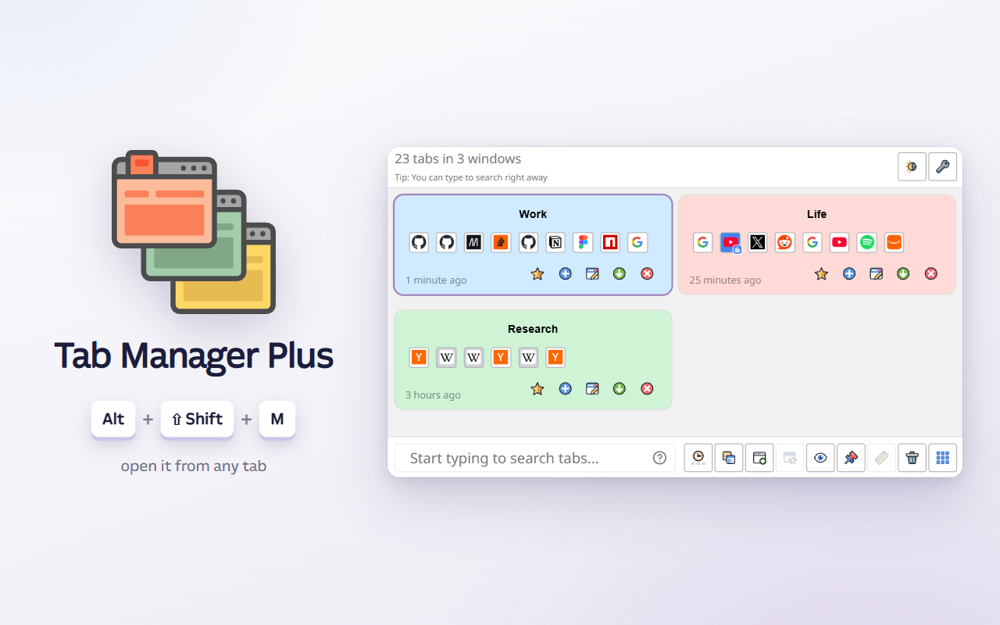
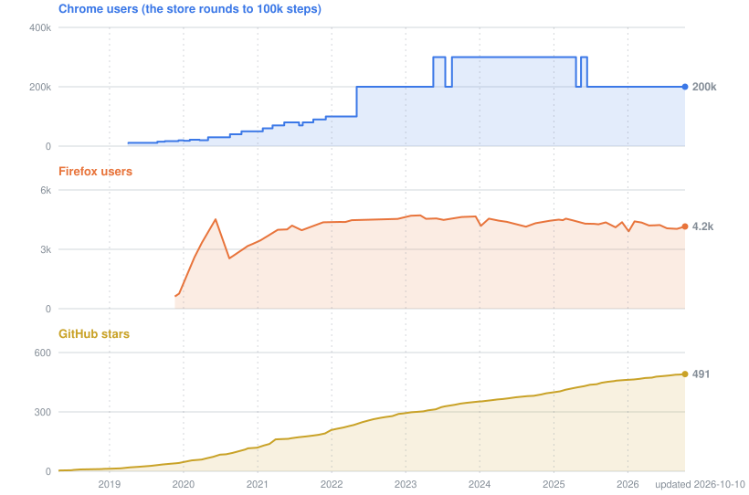

# <sub></sub> Tab Manager Plus <!-- VERSION -->7.0.0<!-- /VERSION -->

##### Search your tabs fast, save windows for later, limit open tabs per window, and more.

[](https://chromewebstore.google.com/detail/tab-manager-plus-for-chro/cnkdjjdmfiffagllbiiilooaoofcoeff) [](https://chromewebstore.google.com/detail/tab-manager-plus-for-chro/cnkdjjdmfiffagllbiiilooaoofcoeff) [](https://addons.mozilla.org/en-US/firefox/addon/tab-manager-plus-for-firefox/) [](https://addons.mozilla.org/en-US/firefox/addon/tab-manager-plus-for-firefox/) [](https://github.com/stefanXO/Tab-Manager-Plus/stargazers) [](https://github.com/stefanXO/Tab-Manager-Plus/releases/latest)

Tab Manager Plus shows all of your open tabs and windows in one place, so you can find, sort and close them quickly. It is an extended version of the old Tab Manager extension for Chrome, built without any malware and without any tracking.

[](https://chromewebstore.google.com/detail/tab-manager-plus-for-chro/cnkdjjdmfiffagllbiiilooaoofcoeff) [](https://addons.mozilla.org/en-US/firefox/addon/tab-manager-plus-for-firefox/)

Version 7.0.0 is out for Chrome, the other browsers that are built on Chromium, and Firefox.



## What is new in 7.0.0

* **A new look.** Every layout has been redone: Block view is now a grid, List view shows one tab per line, and Rows view shows one window per row.
* **Themes.** You can pick System, Light or Dark, and System switches between light and dark whenever your computer does.
* **Tab badges.** Small badges show which tabs play sound, are muted, are asleep or are pinned. List view also shows how recently you used each tab, so forgotten tabs are easy to spot.
* **Duplicates.** Highlight Duplicates selects only the extra copies and keeps the one you used last, so you can close all of the copies in one step.
* **Better search.** You can search only titles with `t:word` or only web addresses with `u:word`, and leave tabs out with `-word`. Quotes find a whole phrase, and a pattern like `/\.pdf$/` finds every open PDF.
* **Keyboard.** The arrow keys move a cursor, Space selects the tab under it, and Shift+arrows select a whole range. Enter switches to the tab, and the Tab key reaches the buttons, so you can do everything without the mouse.
* **Recent tabs.** A new clock button selects the tabs you used most recently, and each further click reaches a little further back in time.
* **Saved windows.** You can rename and recolor saved windows, search inside them, and drag tabs into and out of them. If you delete one by mistake, you can undo it.
* **Window names and colors last.** The names and colors you give your windows now survive a browser restart, even when the tabs in a window have changed since.
* **Hover cards.** When you rest the mouse on a tab, a card shows when you last used it and what state it is in. A window's card also adds a small map of your monitors that shows where the window sits.
* **Faster.** The popup now opens with its final layout already in place, so nothing jumps around or fills in after it appears.

One limit remains for now: the browser's tab groups are not supported yet.

The [changelog](./CHANGELOG.md) lists every change in this version and in all the earlier ones.

## How to use

Click the toolbar icon, or press Alt+Shift+M (Ctrl+Shift+M on a Mac), to open Tab Manager Plus. Start typing right away to search, and click any tab in the list to switch to it. To close several tabs at once, right-click them to select them, then use the trash button or press Ctrl+Delete (Cmd+Delete on a Mac).

For the full guide, open the options and click "Help: how to use Tab Manager Plus" under Advanced settings, which opens the page `documentation.html`.

## Donations

A lot of work went into this extension for free. Many user requests have been integrated with countless of hours spent into coding, refining and testing of the extension. The extension stays free and is open source - so you can copy it and alter it in any way you want. If you love it, please become a [patreon patron](https://www.patreon.com/bePatron?u=26287710), or [donate to support this extension](https://www.paypal.com/cgi-bin/webscr?cmd=_s-xclick&hosted_button_id=67TZLSEGYQFFW).

Receiving continuous donations really helps me in investing time into all the different extensions, and making sure that they are not neglected, nor that future browser updates keep them from working correctly. It also allows me to make them backwards compatible, for people on older systems. And of course it helps me in taking the time and brain power needed for developing new features and solving your issues for a long time.

Your patronage means that my work was able to help you - and that's already very encouraging for me to continue. Thank you <3

[](https://www.patreon.com/bePatron?u=26287710)

[](https://www.paypal.com/cgi-bin/webscr?cmd=_s-xclick&hosted_button_id=67TZLSEGYQFFW)
[](https://www.paypal.com/cgi-bin/webscr?cmd=_s-xclick&hosted_button_id=67TZLSEGYQFFW)

## Building from source

The extension is written in TypeScript and bundled with esbuild into `build/<browser>/`, which is not part of the repository. Each build is a complete, loadable extension folder: the manifest, the pages, `css/`, `images/` and the bundles under `dist/`. You need [Node.js](https://nodejs.org/) 22.18 or newer (24 recommended; the tests run the TypeScript sources directly, which older versions cannot).

```
git clone https://github.com/stefanXO/Tab-Manager-Plus.git
cd Tab-Manager-Plus
npm ci
npm run build            # -> build/chrome
npm run build:firefox    # -> build/firefox
```

Then load the built folder as an unpacked extension:

* **Chrome / Edge / Brave:** open `chrome://extensions`, turn on *Developer mode*, click *Load unpacked* and pick `build/chrome`.
* **Firefox:** run `npx web-ext run --source-dir build/firefox`, or open `about:debugging` → *This Firefox* → *Load Temporary Add-on* and pick `build/firefox/manifest.json`. The 7.x Firefox version is not published yet, and the current Firefox add-on is still built from the `firefox_521` branch.

Useful scripts:

* `npm run watch` rebuilds on every change (`npm run watch:dev` for an unminified build with source maps). It writes into the same `build/chrome` folder and also re-copies the pages, css, images and the manifest, so a *Reload* on the extension card picks the change up.
* `npm run build:dev` builds once without minification. Add `--devtools` (`node build.mjs --dev --devtools`) to give the dev build the `localhost:8097` content security policy that `npx react-devtools` needs; it is opt-in and never part of the committed manifest.
* `npm test` runs all of the tests once and reports any that fail.
* `npm run package` makes the zip files for release; `npm run release` also runs the checks first.
* `npm run lint:firefox` runs `web-ext lint` over `build/firefox`.
* `npm run check-version` verifies that the version number is the same in every file; `npm version <x.y.z>` bumps it everywhere.

## Other Notes

You can install this extension from the [Chrome Web Store](https://chromewebstore.google.com/detail/tab-manager-plus-for-chro/cnkdjjdmfiffagllbiiilooaoofcoeff) or the [Firefox Add-Ons](https://addons.mozilla.org/en-US/firefox/addon/tab-manager-plus-for-firefox/).

* For a list of changes, check out the [changelog](./CHANGELOG.md), which covers every version released so far.
* Read the [latest Reddit threads](https://www.reddit.com/search/?q=Tab%20Manager%20Plus) where people talk about Tab Manager Plus.
* Browse the [open issues](https://github.com/stefanXO/Tab-Manager-Plus/issues) to see which bugs and ideas are already being tracked.
* [Submit a new issue](https://github.com/stefanXO/Tab-Manager-Plus/issues/new) when you find a bug or would like to suggest a new feature.


Please enjoy.

## Users and stars



Chrome weekly users come from the Chrome Web Store dashboard since October 2021, and from snapshots of the store page before that. Firefox users and GitHub stars are updated once a week by a GitHub Action, with older points from Wayback Machine snapshots and GitHub. Nothing is collected from users.

## License
MPLv2

## Privacy Policy
[We do not track any of your data, period.](./PRIVACY.md) Everything you do in Tab Manager Plus stays inside your own browser.